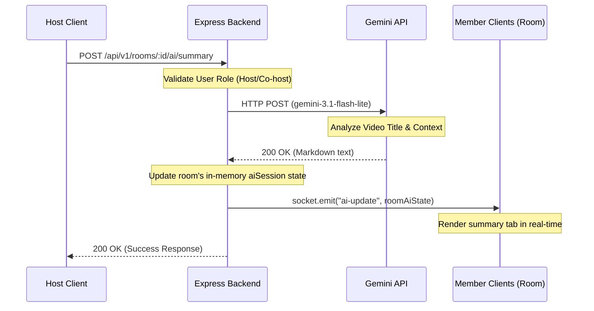

# Gemini AI Assistant Documentation

This document explains the design, architecture, prompt engineering, and API integration details of the optional Gemini AI Assistant in the Watch2Gether platform.

---

## 1. Architectural Overview

The Gemini AI Assistant provides real-time video summaries, discussion prompts, multiple-choice quizzes, and shared concept explanation guides. Because generating high-quality AI content is computationally expensive and can take several seconds, a **REST-Socket Hybrid Synchronization Model** was designed:

1. **REST Endpoints for Heavy Processing (`POST`)**: When a room Host or Co-host triggers an AI action, the client submits a traditional HTTP `POST` request to the backend. This keeps heavy processing threads isolated and prevents locking or lagging the real-time WebSocket connection.
2. **WebSockets for Immediate Sync Broadcast (`ai-update`)**: Once the Gemini API finishes generating the content, the backend saves the updated state to the in-memory `aiSessions` registry and triggers a Socket.IO broadcast to all participants in that room. All peers instantly render the new summaries, questions, or quizzes together.



---

## 2. API Integration Details

The backend interfaces directly with Google's **Gemini 3.1 Flash-Lite** (`gemini-3.1-flash-lite`) model using standard REST calls. This avoids pulling in heavy SDK packages and keeps the runtime lean.

### Endpoint Structure

All AI routes are grouped in the rooms router under `/api/v1/rooms/:id/ai/...` and require standard authentication:

* `POST /:id/ai/summary`: Generates a structured breakdown/summary of the current active video.
* `POST /:id/ai/questions`: Generates 3-4 open-ended discussion questions based on the video context.
* `POST /:id/ai/quiz`: Generates a 3-question multiple-choice quiz (JSON array format).
* `POST /:id/ai/explain`: Receives a custom query string and returns a study guide explanation of that concept.

### Role-Based Access Control (RBAC)
To prevent API abuse and token exhaustion, permissions are strictly checked:
* **Host** / **Co-host**: Full access. Can trigger summaries, generate new discussion questions, spin up new quizzes, and submit study guide queries.
* **Member**: Read-only access to summaries, discussion questions, and quizzes. Can submit queries to the shared Study Explanations tutor feed.
* **Guest**: No access. The AI sidebar tab is hidden entirely.

---

## 3. Prompt Engineering

To guarantee response quality, the system uses tailored instructions for each generation task. The prompts are optimized to constrain the AI and ensure structured, easy-to-parse outputs.

### A. Video Summary Prompt
```
You are an expert educational tutor. Generate a clear, concise, and structured summary of a video with the title: "{videoTitle}".
Format the output in clean, readable markdown bullet points, highlighting the core concept, main discussion themes, key takeaways, and potential real-world applications. Do not output anything other than the markdown text.
```

### B. Discussion Questions Prompt
```
You are an expert tutor facilitating a student watch room. Based on the video title: "{videoTitle}", generate 3-4 thought-provoking, open-ended discussion questions that students can discuss to deepen their understanding of the topic.
Format the output in clean, readable markdown. Do not include answers or explanations, only the questions.
```

### C. Quiz Generation Prompt (Structured JSON Outputs)
To guarantee the frontend can render multiple-choice items dynamically, Gemini is forced to output a strictly structured JSON array.
```
You are an expert tutor. Create a 3-question multiple-choice quiz based on the video titled: "{videoTitle}".
You must output a raw JSON array matching this exact JSON schema:
[
  {
    "question": "The question text",
    "options": ["Option A", "Option B", "Option C", "Option D"],
    "correctIndex": 0
  }
]
Constraints:
1. "correctIndex" must be a 0-based integer pointing to the correct answer in the "options" array.
2. Return ONLY the raw JSON array. Do not wrap it in ```json blocks or include any markdown formatting or comments.
```
*Note: In case the model accidentally outputs markdown enclosures (e.g. ````json ... ````), the backend includes sanitization to strip these tags before parsing the JSON.*

### D. Study Guide Explanations (Explain) Prompt
```
You are a helpful tutor in a collaborative learning session watching a video about: "{videoTitle}".
Explain the following concept or query clearly and educationally: "{query}".
Tailor the explanation to be clear, engaging, and detailed. Format the response in clean markdown.
```

---

## 4. Token Usage & Optimization

Understanding and managing token usage is critical to keeping the system cost-effective and responsive.

### Context Sizing & Resource Cost

By using **Gemini 3.1 Flash-Lite**, the system benefits from a fast, low-latency, and high-efficiency model. The average cost and token consumption breakdown per request is as follows:

| Feature | Input Tokens (Est.) | Output Tokens (Est.) | Average Latency |
| :--- | :--- | :--- | :--- |
| **Video Summary** | 150 - 250 | 200 - 400 | ~2.5 seconds |
| **Discussion Prompts** | 150 - 250 | 150 - 300 | ~2.0 seconds |
| **Quiz Generation** | 200 - 300 | 250 - 500 | ~3.0 seconds |
| **Concept Explanation** | 200 - 350 | 300 - 600 | ~2.8 seconds |

### Key Token Conservation Rules:
1. **Caching Active State**: The generated summaries, discussion prompts, quizzes, and tutor explanations are stored in memory inside the `aiSessions` map. When a new attendee joins the room, they receive the cached state rather than triggering a fresh API call.
2. **Restricting Payload Inputs**: Rather than sending full transcripts or video streams (which would consume thousands of tokens and slow down generation), the system utilizes structured video metadata (Title, active URL, and custom query contexts) as prompt input anchors.
3. **Output Constraints**: Specifying exact length limits (e.g. "a 3-question quiz", "3-4 open-ended discussion questions") prevents the model from generating unnecessarily long, token-heavy responses.
