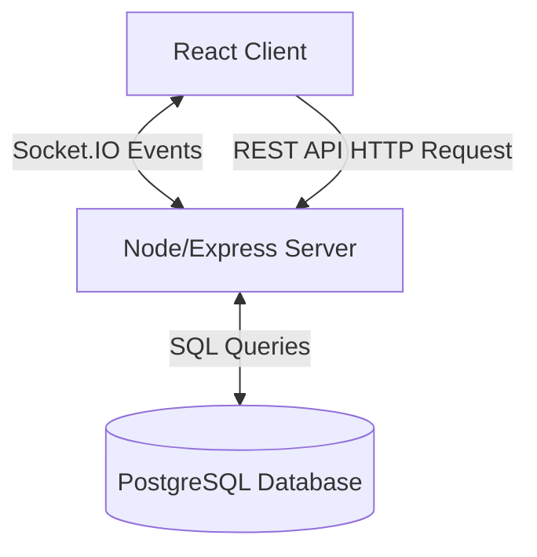
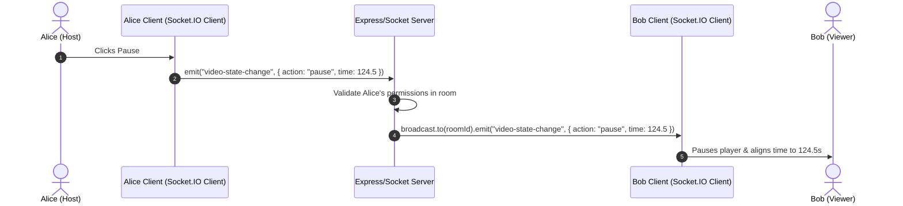
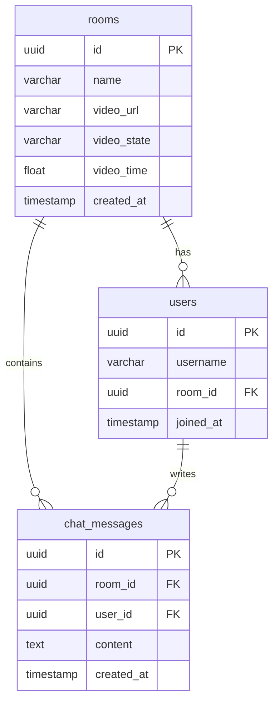

# Watch2Gether Architecture

This document provides a detailed overview of the system architecture, real-time communication patterns, database schema design, and folder organization of the Watch2Gether application.

---

## High-Level System Architecture

Watch2Gether uses a standard client-server architecture augmented with a real-time bi-directional event stream for synchronization.

### Communication Channels

1. **REST API (HTTP):** Used for stateless, request-response operations.
   - Example: Fetching user details, creating room records, validating room availability.
   - Uses versioning (e.g., prefixing endpoints with `/api/v1/`).
2. **WebSockets (Socket.IO):** Used for low-latency, real-time sync.
   - Example: Synchronization of player states (play/pause/seek), real-time chat messages, and updates on room participants.
   - Communicates via named event payloads.

---

## Real-Time Synchronization Flow

When a user interacts with the video player (e.g., pausing or scrubbing), the event flows through the system to keep all other participants synchronized.

### Key Socket Events

| Event Name | Sender | Payload Schema | Description |
| :--- | :--- | :--- | :--- |
| `join-room` | Client | `{ roomId, username }` | Instructs the server to subscribe the current connection to a room channel. |
| `video-state-change` | Client | `{ action: 'play'\|'pause'\|'seek', time: number }` | Sent by the controller when the player status changes. |
| `send-message` | Client | `{ content: string }` | Sends a chat message to the room. |
| `room-users-update` | Server | `[{ id, username }]` | Sent to all clients in a room when someone joins/leaves. |
| `message-received` | Server | `{ id, username, content, timestamp }` | Broadcasted to room members when a message is processed. |

---

## Database Schema (PostgreSQL + Drizzle ORM)

The relational schema is configured using **Drizzle ORM**. Drizzle maps Javascript schemas directly to SQL tables.

---

## Folder Structure Decisions

### Backend Layout
We organize the backend by logical layers to support modular scaling:
* `src/config/`: Keeps variable parsing in one place. Ensures configuration errors throw on start, not hours later.
* `src/db/`: Keeps the database configuration and Drizzle schema code separated from business routes.
* `src/routes/v1/`: Organizes route structures by API resource version. Helps prevent legacy endpoints from breaking when new versions release.
* `src/middleware/`: Global checks like schema validation and error wrapping.
* `src/services/`: Reusable, stateful business utilities (e.g., room synchronization logic).

### Frontend Layout
We arrange the React app using standard layout groupings:
* `src/components/`: Reusable visual building blocks (Button, ChatInput, VideoPlayer).
* `src/context/`: Context engines that control state (Socket connection, User registration).
* `src/routes/`: Router paths and route authentication filters.
* `src/services/`: API requests and Socket event subscriptions.
* `src/hooks/`: Abstract UI-state triggers (e.g., custom listener hooks).
