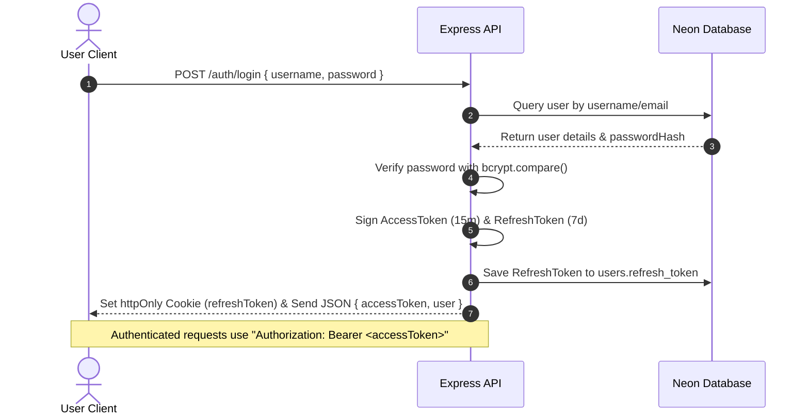
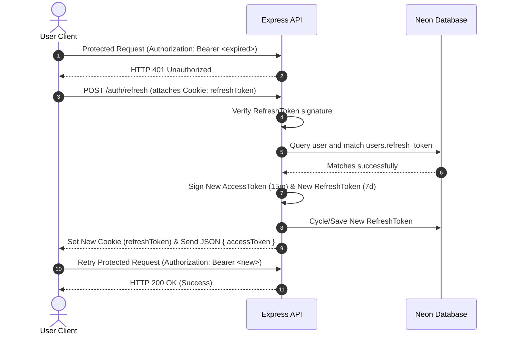

# Authentication Architecture & Tokens Lifecycle

This document explains the security design, token cycle rules, password hashing practices, and encryption schemes implemented for **Watch2Gether**.

---

## JSON Web Tokens (JWT) Flow

Watch2Gether uses standard token-based authentication. The client stores a short-lived Access Token in memory, and the browser stores a long-lived Refresh Token in a secure `httpOnly` cookie.

### Access Token Expiration & Rotation

When the short-lived Access Token expires, the client uses the HttpOnly Refresh Token to silently fetch a new Access Token.

---

## Tokens Lifecycle: Access vs. Refresh

| Property | Access Token | Refresh Token |
| :--- | :--- | :--- |
| **Lifetime** | 15 Minutes (Short-lived) | 7 Days (Long-lived) |
| **Contents** | User claims (id, username, email, avatarUrl) | User ID (for verification) |
| **Storage Location** | In-Memory (React State) | Browser Cookie (`httpOnly`, `sameSite: strict`) |
| **Transmission** | Authorization header (`Bearer <token>`) | Automatically sent by browser via cookie headers |
| **Usage** | Authorizes specific REST/Socket calls | Requests new Access Tokens when they expire |

---

## Authentication vs. Authorization

While authentication checks identity validity (signature decoding), resource-level protection is governed by **Authorization**. For details regarding ownership restrictions, password update verifications, and avatar file upload flows, consult the [User Profile Management Documentation](file:///d:/Chandan/projects/watch2gether/docs/users.md).

---

## Security Considerations

1. **XSS (Cross-Site Scripting) Mitigation:**
   By storing the Refresh Token in an **`httpOnly` cookie**, client-side JavaScript code (including malicious injected scripts) cannot read or steal the token.
   
2. **CSRF (Cross-Site Request Forgery) Protection:**
   The refresh cookie uses **`sameSite: 'strict'`**, which prevents the browser from attaching the cookie during cross-origin requests, blocking CSRF vectors.
   
3. **Refresh Token Rotation (RTR):**
   Every time `/auth/refresh` is requested, the server generates a new Refresh Token and invalidates the old one. If an attacker steals a refresh token, any double-reuse attempt will trigger immediate session termination for safety.

---

## Password Hashing with Bcrypt

Plain-text passwords must never be stored in a database. Watch2Gether utilizes **Bcrypt** to secure passwords before writing them to Neon:

* **Salting:** Bcrypt generates a random string of characters (a "salt") and merges it with the password before hashing it. This prevents attackers from using pre-computed lookups ("rainbow tables") to crack passwords.
* **Key Stretching:** Bcrypt repeats the hashing process thousands of times based on a **cost factor** (we use **10 salt rounds**). This makes the hash slow to compute, protecting passwords against high-speed brute-force attacks while remaining imperceptibly fast for single logins (taking less than 100ms).
