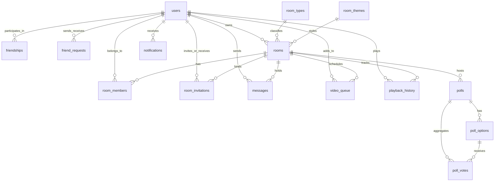

# PostgreSQL Database Architecture & Schema Design

This document details the database schema, constraints, indexes, and normalization strategies implemented for the **Watch2Gether** platform.

---

## Entity Relationship (ER) Concept

Below is a conceptual layout mapping how the 15 entities relate to one another:

---

## Table Descriptions

### 1. `users`
* **Purpose:** Stores user profile identifiers.
* **Fields:**
  - `id` (UUID): Primary Key.
  - `username` (VARCHAR): Unique username (max 50 chars).
  - `email` (VARCHAR): Optional unique email (max 255 chars).
  - `created_at` / `updated_at`: Default timestamps.

### 2. `friendships`
* **Purpose:** Maps symmetrical active relationships between users.
* **Fields:**
  - `id` (UUID): Primary Key.
  - `user_id` (UUID): References sending user.
  - `friend_id` (UUID): References receiving user.
  - `status` (VARCHAR): Either `'active'` or `'blocked'`.

### 3. `friend_requests`
* **Purpose:** Stores pending connection requests between users.
* **Fields:**
  - `id` (UUID): Primary Key.
  - `sender_id` / `receiver_id`: References user ids.
  - `status` (VARCHAR): `'pending'`, `'accepted'`, or `'declined'`.

### 4. `room_types`
* **Purpose:** Lookup table for rooms access control configurations.
* **Fields:**
  - `code` (VARCHAR): Primary Key (`'public'`, `'private'`, `'password_protected'`).
  - `name` / `description`: Text labels.

### 5. `room_themes`
* **Purpose:** Stylesheet preset codes (background images and hex colors).
* **Fields:**
  - `id` (UUID): Primary Key.
  - `name` / `primary_color` / `background_color` / `background_image_url`.

### 6. `rooms`
* **Purpose:** Tracks watch party states (active URLs and playback synchronization metrics).
* **Fields:**
  - `id` (UUID): Primary Key.
  - `name` (VARCHAR): Room label.
  - `room_type_code` (VARCHAR): Foreign Key pointing to `room_types.code`.
  - `password_hash` (VARCHAR): Hashed password for restricted access.
  - `owner_id` (UUID): References the creator user.
  - `video_url` (TEXT): Currently loaded video source.
  - `video_state` (VARCHAR): `'playing'` or `'paused'`.
  - `video_time` (DOUBLE PRECISION): Position in seconds.
  - `theme_id` (UUID): References `room_themes.id`.

### 7. `room_members`
* **Purpose:** Active room connection mapping.
* **Fields:**
  - `id` (UUID): Primary Key.
  - `room_id` (UUID): Foreign Key referencing `rooms.id`.
  - `user_id` (UUID): Foreign Key referencing `users.id`.
  - `role` (VARCHAR): `'host'`, `'moderator'`, or `'viewer'`.

### 8. `room_invitations`
* **Purpose:** Tokenized invitations to join private rooms.
* **Fields:**
  - `id` (UUID): Primary key.
  - `room_id` (UUID): References target room.
  - `inviter_id` / `invitee_id` (UUID): References sender/recipient.
  - `token` (VARCHAR): Secure URL token string.
  - `status` (VARCHAR): `'pending'`, `'accepted'`, or `'expired'`.
  - `expires_at` (TIMESTAMP): Expiration deadline.

### 9. `polls`
* **Purpose:** Houses questions for interactive watch room polls.
* **Fields:**
  - `id` (UUID): Primary Key.
  - `room_id` (UUID): Target room.
  - `creator_id` (UUID): Author user.
  - `question` (TEXT) / `is_closed` (BOOLEAN).

### 10. `poll_options`
* **Purpose:** Lists selections for a specific poll question.
* **Fields:**
  - `id` (UUID): Primary Key.
  - `poll_id` (UUID): Reference to parent poll.
  - `option_text` (TEXT).

### 11. `poll_votes`
* **Purpose:** Connects a user's vote to a poll option.
* **Fields:**
  - `id` (UUID): Primary Key.
  - `poll_id` (UUID): Target poll.
  - `option_id` (UUID): Chosen option.
  - `user_id` (UUID): Voting user.

### 12. `messages`
* **Purpose:** Normalized chat history.
* **Fields:**
  - `id` (UUID): Primary Key.
  - `room_id` (UUID): Destination room.
  - `user_id` (UUID): Author (nullable for system logs).
  - `content` (TEXT): Text contents.

### 13. `notifications`
* **Purpose:** Logs messages, requests, and invites for users.
* **Fields:**
  - `id` (UUID): Primary Key.
  - `user_id` (UUID): Target user.
  - `type` / `title` / `content` / `is_read` / `reference_id`.

### 14. `video_queue`
* **Purpose:** Stores ordered playback queues for rooms.
* **Fields:**
  - `id` (UUID): Primary Key.
  - `room_id` (UUID): Target room.
  - `added_by_id` (UUID): Submitting user.
  - `video_url` / `title` / `duration` / `is_played`.
  - `sort_order` (INTEGER): Value used for list ordering.

### 15. `playback_history`
* **Purpose:** Historically logged video plays.
* **Fields:**
  - `id` (UUID): Primary Key.
  - `room_id` (UUID): Target room.
  - `played_by_id` (UUID): Playing user.
  - `video_url` / `title` / `started_at` / `ended_at`.

---

## Relationship Explanations

### One-to-Many (1:N)
A one-to-many relationship exists when a single record in Table A is linked to multiple records in Table B, but a record in Table B links to only one record in Table A.
* **Example (`rooms` ─── `messages`):** A single room can contain thousands of chat messages, but each individual chat message exists in exactly one room.
* **Example (`polls` ─── `poll_options`):** A single poll question has multiple selectable options, but each option belongs to only one poll.
* **Implementation:** Add a Foreign Key column in the "Many" table referencing the Primary Key of the "One" table.

### Many-to-Many (M:N)
A many-to-many relationship exists when multiple records in Table A link to multiple records in Table B.
* **Example (`users` ─── `rooms`):** A user can join multiple watch rooms, and a single watch room contains multiple users.
* **Example (`users` ─── `users` as Friends):** A user has many friends, and is conversely a friend to many users.
* **Implementation:** Relational databases resolve this by creating a **Join Table** containing Foreign Key references pointing to both target tables.
  - In our schema, `room_members` serves as the join table for `users` and `rooms`.
  - `friendships` serves as the join table connecting `users` to other `users`.

---

## Indexing Strategy

To keep queries fast, we added indexes to specific columns that are frequently used in search, ordering, and join operations:

1. **Foreign Key Indexes:** 
   PostgreSQL does not index foreign keys by default. When joining tables (e.g., matching `room_members.user_id` with `users.id`), the database would have to scan the entire table. We added indexes on all foreign key columns (like `userIdIdx` and `roomIdx`) to speed up these joins.
   
2. **Composite Uniqueness Indexes:**
   We added compound unique constraints (such as `uniqFriendship` on `(user_id, friend_id)`) to enforce rules at the database level (e.g. preventing a user from having two duplicate friendship rows with the same friend). Under the hood, PostgreSQL automatically builds unique indexes for these columns, making query checks extremely fast.
   
3. **Sorted Query Indexes:**
   Columns that are frequently sorted (like `sort_order` in `video_queue` or `created_at` in `messages`) are indexed to avoid expensive in-memory sort operations during data fetches.
