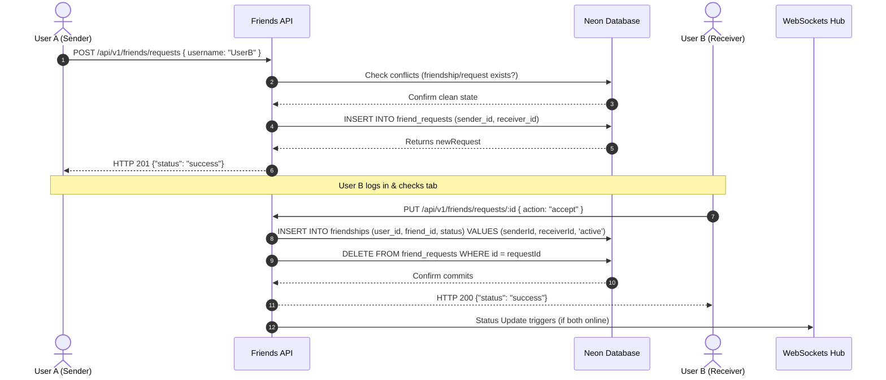

# Friend System Architecture & Workflows

This document explains the technical design, database normalization schemas, API validation rules, and WebSocket synchronization processes for the Friend System.

---

## 1. Database Schema Design

The friend system uses two database tables to record user relationships and requests:

### 1. Friend Requests Table: `friend_requests`
Tracks pending invitations from one user to another.
* `id` (UUID, Primary Key)
* `sender_id` (UUID, Foreign Key): References `users.id` (creator of request)
* `receiver_id` (UUID, Foreign Key): References `users.id` (recipient)
* `status` (Varchar, Default `'pending'`): `'pending'`, `'accepted'`, or `'declined'`
* `created_at` (Timestamp)

*Index Optimization*: Indexes exist on `sender_id` and `receiver_id`. A unique constraint (`sender_id`, `receiver_id`) prevents duplicate friend requests between the same pair of users.

### 2. Friendships Table: `friendships`
Tracks established symmetrical relationships.
* `id` (UUID, Primary Key)
* `user_id` (UUID, Foreign Key): References `users.id`
* `friend_id` (UUID, Foreign Key): References `users.id`
* `status` (Varchar, Default `'active'`): `'active'` or `'blocked'`
* `created_at` (Timestamp)

*Symmetrical Queries*: Symmetrical designs allow storing a single row for a friendship relationship. When querying friends, the backend joins the `users` table on both fields using an `OR` or separate query splits:
* Query split 1: Where `userId = currentUser` (returns friend details linked to `friendId`).
* Query split 2: Where `friendId = currentUser` (returns friend details linked to `userId`).

---

## 2. Request & Friendship Lifecycle Flow

The creation and resolution of user friendships proceed through these lifecycle steps:

1. **Send Request**:
   - User A inputs User B's username. The request checks that User B exists, is not User A, has no existing active friendship with A, and has no pending request in either direction.
   - A pending row is committed to `friend_requests`.
2. **Accept Request**:
   - User B clicks "Accept".
   - The API verifies the request recipient is B, inserts a row into `friendships` mapping A and B as active friends, and deletes the resolved row from `friend_requests`.
3. **Decline Request**:
   - User B clicks "Decline".
   - The API deletes the request row from `friend_requests` to permit clean retries in the future.
4. **Remove Friend**:
   - Either User A or User B clicks "Remove Friend".
   - The API deletes the matching row in `friendships` by ID, immediately severing the relationship.

---

## 3. WebSockets Real-Time Online Status Tracking

To display whether a friend is online, Watch2Gether maintains a state tracking mechanism:

1. **Global Connection**:
   - When a user logs in, the React frontend establishes a single global WebSocket connection.
   - The client emits a `register-user` event, sending their active `userId`.
2. **Backend Connection Registry**:
   - The backend socket service maintains an in-memory `onlineUsers` Map (`userId` -> Set of connected `socket.ids`).
   - A reverse map `socketToUser` tracks which user owns each socket ID.
   - Upon connection, the socket ID is added to the user's set. A global event `user-status-changed` with `{ userId, status: 'online' }` is broadcasted.
3. **API Integration**:
   - When fetching friends (`GET /api/v1/friends`), the router checks `onlineUsers.has(friend.id)` and appends `isOnline: true` or `false` to the REST response.
4. **Real-time Updates**:
   - The Lobby component listens for `user-status-changed` socket events and dynamically toggles the online indicator (green/gray dot) for any matching friend in the list without reloading the page.
5. **Connection Drop (Offline)**:
   - When a socket disconnects, the socket ID is removed from the user's registry.
   - If the user's set of active sockets becomes empty (e.g., they closed all browser tabs or clicked Logout), the backend deletes their key from the map and broadcasts a `user-status-changed` offline event.
