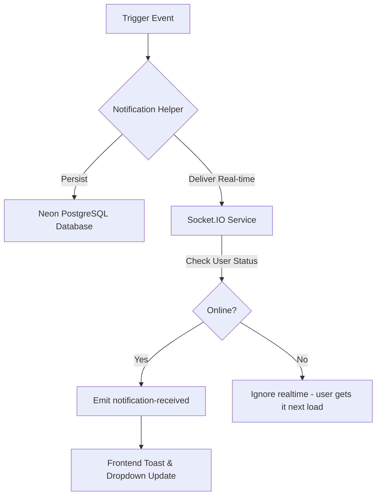
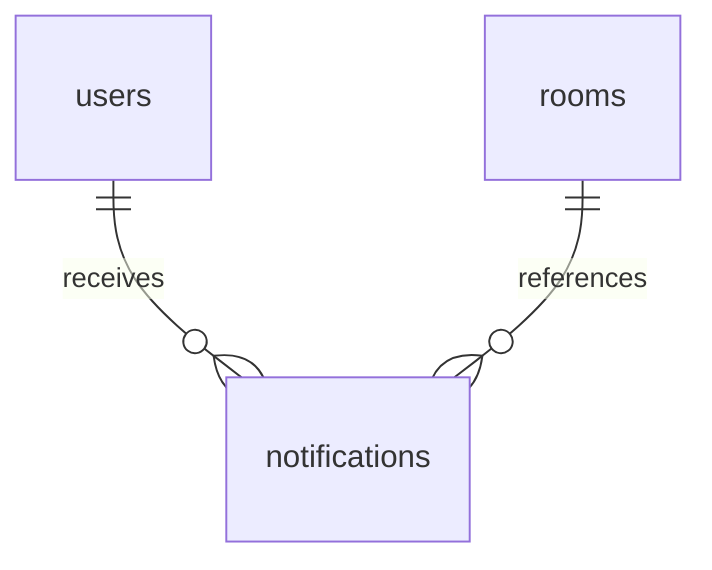

# Notification Architecture & Workflows

This document explains the technical design, database persistence schemas, API endpoints, real-time delivery pipeline, and frontend integration for notifications in Watch2Gether.

---

## 1. Notification Architecture Overview

The system uses a hybrid model of **Database Persistence** and **Real-Time WebSockets delivery** to guarantee that notifications are both stored permanently (so users see them when logging in later) and delivered immediately (if they are online).



### Flow Steps:
1. **Trigger**: An event occurs (e.g. friend request sent, user invited to room, chat mention `@username`, or friend starts a room).
2. **Persistence**: The backend executes `createNotification()`, inserting a row into the `notifications` table.
3. **Real-time Delivery**: The helper checks if the target user is currently online using the active socket registry `onlineUsers`.
4. **Socket Emission**: If one or more active sockets are found, the server emits a `notification-received` socket event with the persisted notification object.
5. **UI Update**: The client-side listens for `notification-received`, showing an animated, temporary slide-in toast card and appending the notification to the Navbar bell tray in real time.

---

## 2. Relational Database Schema

Notifications are persisted using the `notifications` table:



### Table: `notifications`
* `id` (UUID, Primary Key): Unique identifier of the notification.
* `user_id` (UUID, Foreign Key): References `users.id` (the recipient of the notification).
* `type` (Varchar, Not Null): The type of notification:
  - `'friend_request'`
  - `'room_invite'`
  - `'mention'`
  - `'friend_started_room'`
* `title` (Varchar, Not Null): Short display header (e.g., `'New Friend Request'`).
* `content` (Text): Body descriptive text (e.g., `'Alice invited you to join the room "Movie Lounge"'.`).
* `is_read` (Boolean, Default `false`): Tracks read status.
* `reference_id` (UUID, Nullable): Points to the corresponding entity ID:
  - The `friendRequests.id` for friend requests.
  - The `rooms.id` for room invites, mentions, and friend-started rooms.
* `created_at` (Timestamp): Record creation date.

---

## 3. API Reference

All routes require authentication.

### `GET /api/v1/notifications`
* **Description**: Fetch all notifications for the logged-in user (sorted by `created_at` descending).
* **Response `200 OK`**:
  ```json
  {
    "status": "success",
    "data": [
      {
        "id": "a0a1b2c3-d4e5-f6g7-h8i9-j0k1l2m3n4o5",
        "userId": "u0u1u2u3-u4u5-u6u7-u8u9-u0u1u2u3u4u5",
        "type": "room_invite",
        "title": "New Room Invitation",
        "content": "Alice invited you to join the room: \"Action Lounge\"",
        "isRead": false,
        "referenceId": "r0r1r2r3-r4r5-r6r7-r8r9-r0r1r2r3r4r5",
        "createdAt": "2026-06-17T14:15:33.000Z"
      }
    ]
  }
  ```

### `PUT /api/v1/notifications/:id/read`
* **Description**: Mark a single notification as read.

### `PUT /api/v1/notifications/read-all`
* **Description**: Mark all notifications of the user as read.

### `DELETE /api/v1/notifications/:id`
* **Description**: Delete a notification.

### `DELETE /api/v1/notifications`
* **Description**: Clear all notifications.

---

## 4. Real-time Socket Event Schema

When a user is online, they receive:

### Event: `notification-received`
* **Payload**: The exact JSON notification object returned from the database creation.

---

## 5. UI Integration & User Flow

### Navbar Bell Dropdown
- Located in the application header.
- Displays a pulsing red count badge when there are unread notifications.
- Clicking the bell opens a dropdown listing notifications with contextual options:
  - **Inline actions** (Accept/Decline for friend requests; Join Lounge for room events).
  - **Mark all read** and **Clear all** shortcuts.

### Generic Toast Slide-in
- Renders at the bottom-right corner.
- Automatically dismisses after 6 seconds.
- Provides interactive buttons directly on the toast (Accept/Decline/Join Lounge) allowing users to respond to events without opening the tray.
