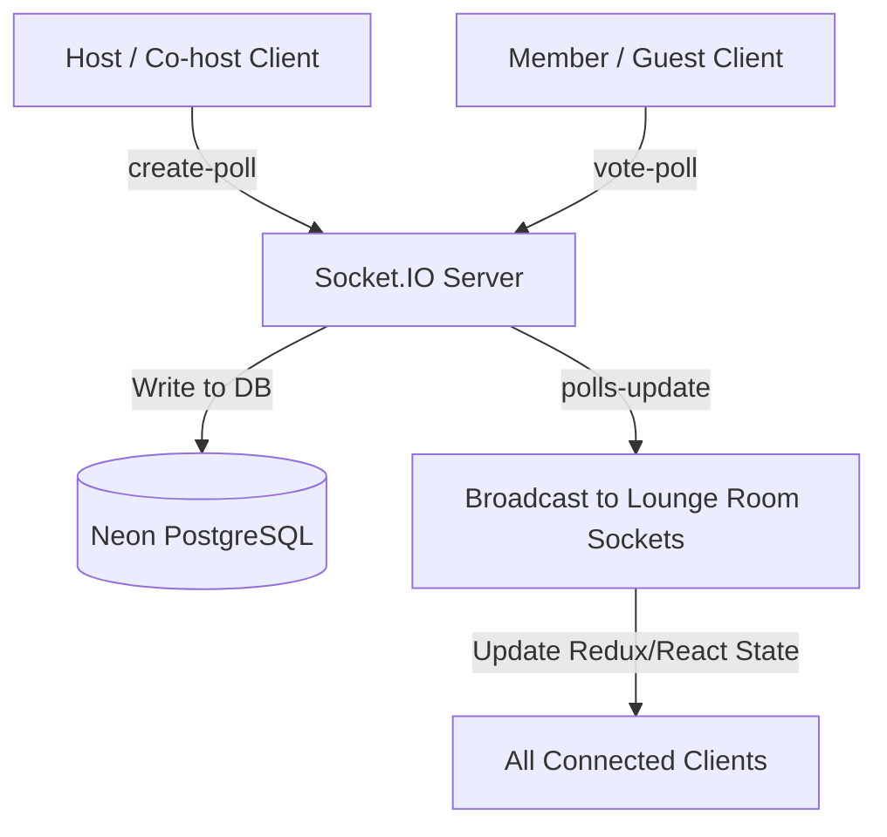

# Real-Time Lounge Polls & Voting Architecture

This document details the real-time voting architecture, database design, and Socket.IO schemas used to implement generic room polls inside watch lounges.

---

## 1. Real-Time Voting Architecture

To keep polls and vote counts perfectly in sync across different user browser sessions without spamming database connections, we use a **reactive event-driven architecture**:



### Protocol Steps:
1. **Creation**: Senders who hold `'host'` or `'co-host'` roles emit a `'create-poll'` event. The server saves the poll and its choices.
2. **Casting Votes**: Sockets emit a `'vote-poll'` event. The server handles validation, checks database constraints, handles vote changes/retractions, saves the updates, and compiles the latest roster results.
3. **Broadcasting**: Sockets in the room receive `'polls-update'` with a compiled list of all room polls, their choices, vote counts, and the list of voter usernames.
4. **Local Render**: Clients compute total vote weights and render animated percentage slide overlays locally. Hovering over option vote badges displays the usernames of who voted for that choice.

---

## 2. Database Design

Polls are represented via three normalized relational tables: `polls`, `poll_options`, and `poll_votes`.

### 2.1. Polls Table
Stores the question, creator, status, and the template type:
* **`type`** (`varchar`): Categorizes template behaviors. Values: `'content_selection'`, `'satisfaction_feedback'`, `'audio_quality'`, `'custom'`.
* **`is_closed`** (`boolean`): Marks if a poll is closed. Closed polls are read-only.

### 2.2. Poll Options Table
Stores individual choices for a poll. Foreign keyed to `polls.id` with cascade deletion.

### 2.3. Poll Votes Table
Stores individual member selections.
* **Single-Vote Constraint**: Enforces a database-level unique index on `(poll_id, user_id)`. This guarantees a user can vote at most once per poll.
* **Toggle/Retraction**: If a user votes for the same option twice, the server deletes the vote record. If they select a different option, the server updates the `option_id` foreign key.

---

## 3. WebSocket Message Schema

### 3.1. Client $\rightarrow$ Server Events

#### `create-poll`
Dispatched by Host or Co-host to initialize a poll.
* **Payload**:
  ```typescript
  interface CreatePollPayload {
    question: string;
    type: 'custom' | 'content_selection' | 'satisfaction_feedback' | 'audio_quality';
    options: string[]; // Minimum 2 non-empty choices
  }
  ```

#### `vote-poll`
Dispatched by any lounge member to cast or retract a vote.
* **Payload**:
  ```typescript
  interface VotePollPayload {
    pollId: string;   // UUID
    optionId: string; // UUID
  }
  ```

#### `close-poll`
Dispatched by Host/Co-host to lock a poll and display final results.
* **Payload**:
  ```typescript
  interface ClosePollPayload {
    pollId: string;
  }
  ```

#### `delete-poll`
Dispatched by Host/Co-host to delete a poll.
* **Payload**:
  ```typescript
  interface DeletePollPayload {
    pollId: string;
  }
  ```

---

### 3.2. Server $\rightarrow$ Client Events

#### `polls-update`
Sent by the server to room members upon join, creation, voting, closing, or deletion.
* **Payload**:
  ```typescript
  interface PollsUpdatePayload {
    id: string;
    roomId: string;
    question: string;
    type: 'custom' | 'content_selection' | 'satisfaction_feedback' | 'audio_quality';
    isClosed: boolean;
    createdAt: string;
    closedAt: string | null;
    creatorUsername: string;
    options: {
      id: string;
      optionText: string;
      votesCount: number;
      voters: {
        userId: string;
        username: string;
      }[];
    }[];
  }[]
  ```
