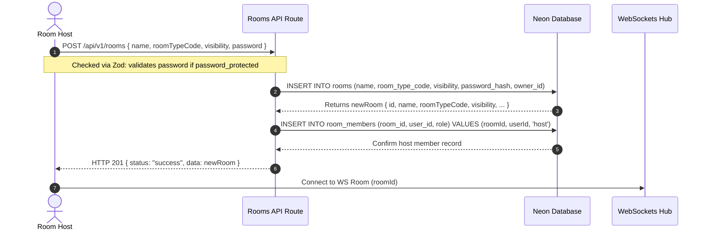
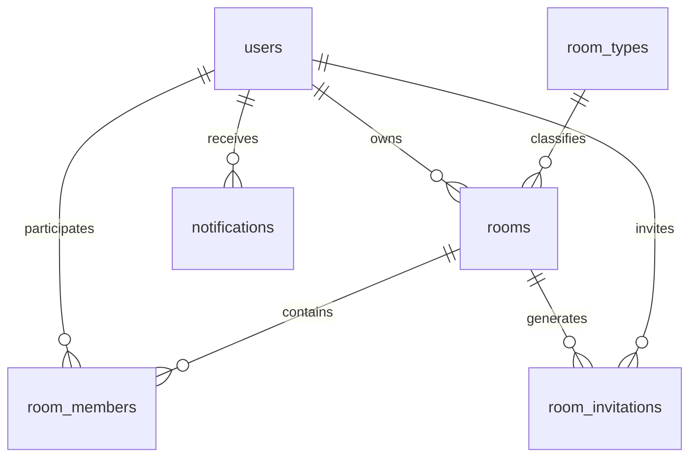

# Room Lookup Architecture & Workflows

This document explains the technical design, database normalization schemas, API validation rules, room lifecycle stages, permission systems, and database relationships for room management.

---

## 1. Room Creation Flow

When a user creates a new room:
1. The Lobby page prompts the user to select a room category, name, visibility (Public, Private, or Password Protected), and a password (if Password Protected).
2. The user submits the form, initiating a `POST /api/v1/rooms` request containing the room name, category code (`roomTypeCode`), visibility, and optional password.
3. The Express route handler validates the request body using a Zod schema. If the category code is invalid, or if password visibility is chosen but no password is provided, a `400 Bad Request` validation response is returned.
4. If valid, the backend hashes the password (using `bcrypt` if password protected) and inserts a new record into the `rooms` table, associating it with the selected `roomTypeCode`, `visibility`, and `ownerId`.
5. An automatic host membership record is created in the `room_members` table for the creator user with the role `'host'`.
6. The user is redirected to the `/room/:roomId` watch session lounge and establishes a WebSockets connection.



---

## 2. Relational Database Schema

The room architecture operates on the following tables:

### Lookup Table: `room_types`
Stores static configurations and properties for each room category.
* `code` (Varchar, Primary Key): e.g. `'movie_night'`
* `name` (Varchar, Not Null): e.g. `'Movie Night'`
* `description` (Text): e.g. `'Watch films and series with friends.'`

### Main Table: `rooms`
* `id` (UUID, Primary Key)
* `name` (Varchar, Not Null)
* `room_type_code` (Varchar, Foreign Key): References `room_types.code`
* `visibility` (Varchar, Default `'public'`): `'public'`, `'private'`, or `'password_protected'`
* `password_hash` (Varchar, Nullable): Hashed password for password-protected rooms
* `owner_id` (UUID, Foreign Key): References `users.id`
* `video_url` (Text)
* ...

### Many-to-Many Table: `room_members`
Links users to rooms with specific roles.
* `id` (UUID, Primary Key)
* `room_id` (UUID, Foreign Key): References `rooms.id`
* `user_id` (UUID, Foreign Key): References `users.id`
* `role` (Varchar, Default `'member'`): `'host'`, `'co-host'`, `'member'`, or `'guest'`
* `joined_at` (Timestamp)

---

## 3. Database Relationships

The room management feature relies on a normalized relational layout with constraints:



1. **One-to-Many (`users` -> `rooms`)**: A user can own multiple rooms. The owner of a room is set via `rooms.owner_id`.
2. **Many-to-Many (`users` <-> `rooms` via `room_members`)**: Multiple users can join a room, and a user can participate in multiple rooms. Each membership maps to a specific room-level role (`host`, `co-host`, `member`, `guest`).
3. **One-to-Many (`room_types` -> `rooms`)**: Each room belongs to one room category, enforcing lookups for category parameters.
4. **One-to-Many (`rooms` -> `room_invitations`)**: A room can have multiple pending invitations generated by hosts or co-hosts.
5. **One-to-Many (`users` -> `notifications`)**: Inviting a user inserts a notification record pointing to `notifications.user_id` as the invitee.

---

## 4. Room Lifecycle

The lifecycles of synchronized rooms dictate database consistency:

1. **Create Stage**:
   - Creator enters name, category, and access status (Public, Private, Password-Protected).
   - Backend hashes password inputs. DB commits the `rooms` record.
   - Host membership is established immediately in `room_members` to ensure ownership.
2. **Join Stage**:
   - Users browse public rooms on the Lobby dashboard, input direct IDs, or follow invite links.
   - If they are already in `room_members` for that room, they enter directly.
   - If not, and the room is `password_protected`, the frontend catches a `PASSWORD_REQUIRED` code and displays a password interface.
   - Valid password submissions insert the attendee as a `'member'` in `room_members` table.
3. **Active State (Real-Time Sync)**:
   - Sockets handle play, pause, seek, chat, and room notifications.
   - User promotions/demotions and kicks occur via active REST/Socket triggers.
4. **Leave Stage**:
   - Navigation away or button clicks triggers component unmounting, prompting the client socket to disconnect.
   - The backend socket `disconnect` event catches the dropped connection and deletes the corresponding row in `room_members`.
5. **Delete Stage (Clean Up)**:
   - The Host initiates room deletion, calling `DELETE /api/v1/rooms/:id`.
   - Foreign key constraints with `ON DELETE CASCADE` automatically purge dependent rows across `room_members`, `messages`, `video_queue`, and `room_invitations`.
   - Real-time sockets emit `room-deleted` alerting remaining users to redirect to the Lobby.

---

## 5. Permission & Access Control System

Access controls operate on a role-based permission system matching individual rooms:

### Access Types

* **Public Rooms**: Listed on the Lobby dashboard. Anyone can browse and join.
* **Private Rooms**: Unlisted. Joining requires a direct link/ID or invite token.
* **Password Protected Rooms**: Requires inputting a secure password on entry (for non-members).

### Role Hierarchy & Permissions

| Permission | Host | Co-host | Member | Guest |
| :--- | :---: | :---: | :---: | :---: |
| **Delete Room** | ✅ | ❌ | ❌ | ❌ |
| **Promote/Demote Roles** | ✅ | ❌ | ❌ | ❌ |
| **Kick Attendees** | ✅ | ❌ | ❌ | ❌ |
| **Invite Users** | ✅ | ✅ | ❌ | ❌ |
| **Sync Video (Play/Pause/Seek/URL)** | ✅ | ✅ | ❌ | ❌ |
| **Queue Management (Add/Remove/Skip)** | ✅ | ✅ | ❌ | ❌ |
| **Poll Management (Create/Close/Delete)** | ✅ | ✅ | ❌ | ❌ |
| **Chat Moderation (Delete Messages)** | ✅ | ✅ | ❌ | ❌ |
| **Participate in Chat** | ✅ | ✅ | ✅ | ❌ |
| **Watch Synchronized Stream** | ✅ | ✅ | ✅ | ✅ |

- **Host**: The room owner. Has absolute authority, including room deletion and membership moderation (kick/promote/demote).
- **Co-host**: Promoted attendee. Assisting with streaming moderation; has full controls over the synchronized media player state, playlist queue, active polls, and chat moderation (deleting messages).
- **Member**: Standard attendee. Enjoys chatting and viewing, but cannot change playback states, manage queue, create polls, moderate chat, or kick/promote other users.
- **Guest**: Watch-only attendee. Has no chat permission and cannot control playback.

---

## 6. Role-Based Access Control (RBAC) Architecture

Watch2Gether uses a **Role-Based Access Control (RBAC)** architecture to govern room operations. Instead of checking raw user IDs for every feature, permissions are tied to **Roles** assigned to a user within a specific Room.

### Database Role Enforcement
A user's role in a room is stored in the `room_members` join table under the `role` field. The possible roles are:
1. `host` (Owner/Creator)
2. `co-host` (Moderator with playback and queue control)
3. `member` (Standard viewer with chat access)
4. `guest` (Watch-only participant)

### Backend socket verification
For any privileged WebSocket action (e.g., `video-state-change`, `skip-video`, `add-to-queue`, `remove-from-queue`, `create-poll`, `close-poll`, `delete-poll`, `delete-message`), the backend retrieves the sender's role in the corresponding room using `roomMembers` table:

```javascript
const [memberRecord] = await db
  .select()
  .from(roomMembers)
  .where(and(eq(roomMembers.roomId, roomId), eq(roomMembers.userId, userId)));

const role = memberRecord?.role || 'member';
if (role !== 'host' && role !== 'co-host') {
  // Reject request
}
```

### Frontend UI Gatekeeping
The frontend uses the `roomData.currentUserRole` to show or hide UI components and block restricted actions:
- **Queue additions & deletions**: Add-to-queue form and delete buttons are gated behind `isHostOrCoHost`. Non-hosts/co-hosts see a descriptive warning instead.
- **Chat Moderation**: The message hover quick-picker displays a delete message button (trash icon) only if the attendee is a Host or Co-host.
- **Video controls & syncing**: Gated so that ReactPlayer controls and the Sync URL form are only accessible to Hosts and Co-hosts.
- **Promotions & Moderation**: The member controls panel (role dropdowns and kick button) is only visible to the lounge `Host`.
