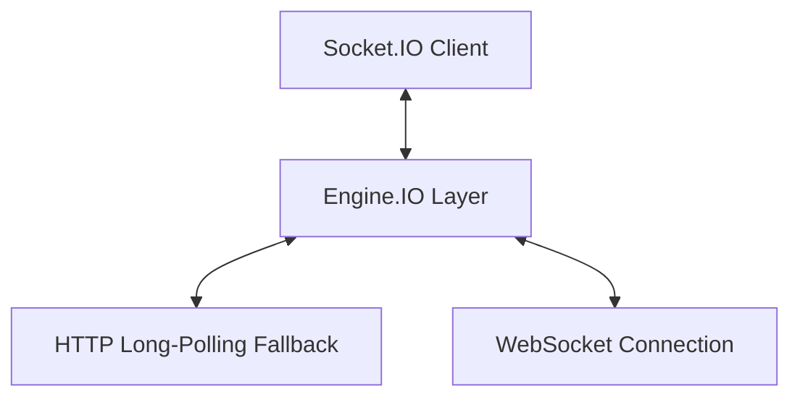
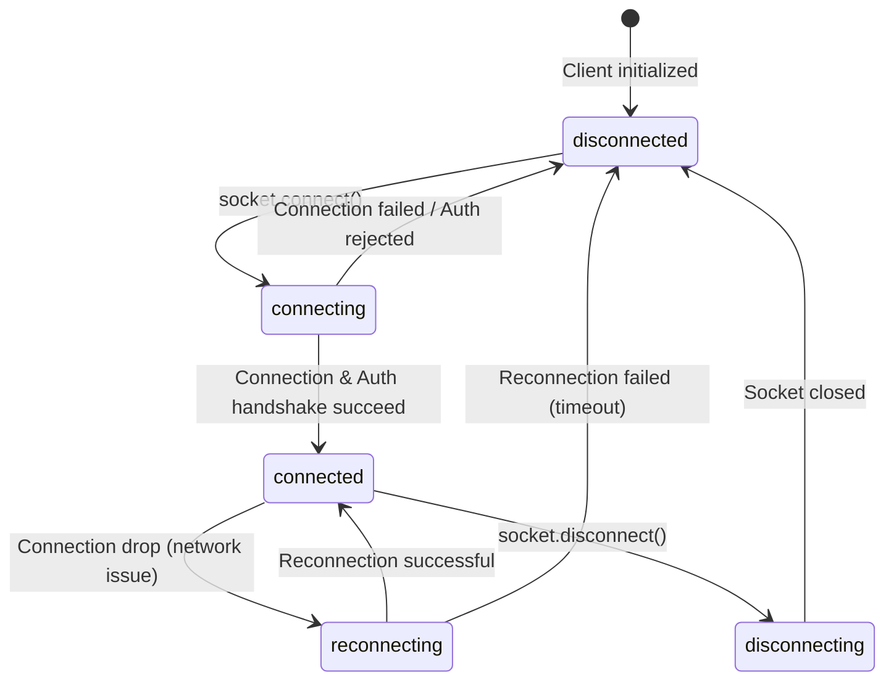
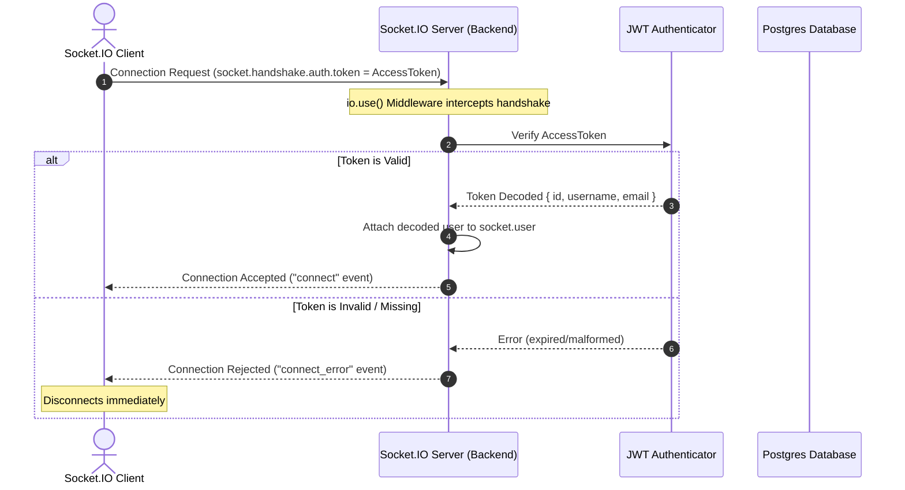
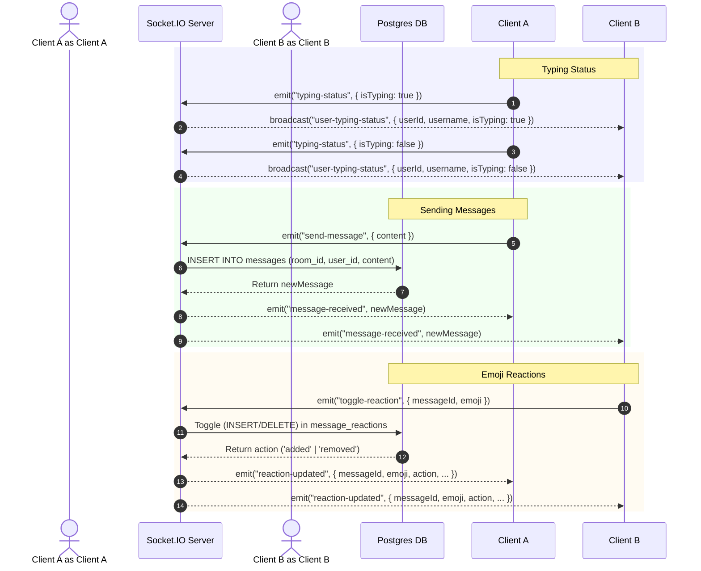

# Socket.IO Real-Time Architecture & Handshake Authentication

This document explains the technical architecture, handshake-level authentication, connection state machine, room channels, and robust reconnection mechanics implemented in Watch2Gether.

---

## 1. WebSockets vs. HTTP: Communication Protocols

To achieve synchronized video playback and live chat across multiple devices, Watch2Gether utilizes WebSockets instead of traditional HTTP polling. The table below outlines the core differences:

| Metric / Feature | HTTP (HyperText Transfer Protocol) | WebSockets (WS / WSS Protocol) |
| :--- | :--- | :--- |
| **Connection Type** | Stateless, short-lived. Each request opens a new TCP connection (or reuses a keep-alive connection). | Stateful, persistent. A single TCP handshake establishes a long-running tunnel. |
| **Communication** | Unidirectional (Client-initiated request/response). Server cannot push data without a request. | Bi-directional (Full-duplex). Both client and server can transmit data at any time. |
| **Payload Overhead** | High. Every request carries HTTP headers, cookies, and user-agent strings. | Low. Minimal framing overhead (typically 2-10 bytes per message) once the handshake finishes. |
| **Real-time Latency** | High. Achieved via polling or long-polling, resulting in delayed sync. | Very low (sub-millisecond transport once connected). |
| **Common Use Cases** | Fetching static content, REST APIs, form submissions, and authentication. | Real-time dashboards, multiplayer gaming, synchronized players, and instant chat. |

---

## 2. Socket.IO Protocol & Transport Layers

Socket.IO is not a raw WebSocket implementation; it is a higher-level framework built on top of the **Engine.IO** protocol. It provides fallback transports and custom frame packaging.



### Polling Fallback & Upgrade
1. **Initial Connection (HTTP Long-Polling)**: The client connects via HTTP polling first to ensure firewall compatibility, load balancing suitability, and fast initial connection establishment.
2. **WebSocket Upgrade**: Engine.IO runs checks in the background. If a WebSocket connection can be successfully established, the transport automatically upgrades to WebSockets, and all future packets flow through it.

### Frame Packaging & Heartbeats
* **Frame Structure**: Messages are serialized into Engine.IO/Socket.IO structured frames. E.g., `42["video-state-change", {"action": "play", "time": 12.5}]` where `4` is the Engine.IO packet type (message) and `2` is the Socket.IO packet type (event).
* **Heartbeats (Ping/Pong)**: The server regularly sends ping packets to the client. The client replies with a pong. If the client fails to respond within a timeout window (e.g., `pingTimeout`), the server assumes connection failure and destroys the connection context.

---

## 3. Connection State Machine

The client socket instance transitions through the following lifecycle states:



* **disconnected**: The socket is not active.
* **connecting**: The socket is initiating connection (sending HTTP handshake / auth details).
* **connected**: Handshake succeeded, authentication middleware passed, and bi-directional stream is active.
* **reconnecting**: A transient connection drop occurred. The client attempts to reconnect using exponential backoff (e.g., trying to reconnect every 1s, 2s, 5s... up to a max wait time).
* **disconnecting**: The socket connection is gracefully cleaning up.

---

## 4. JWT-Authenticated Handshake & Security

To prevent identity spoofing, all socket connections must pass authentication during the handshake phase before they are fully established.



### Backend Enforcement
1. **Connection Guard**: The server implements an `io.use()` middleware that intercepts every connection handshake.
2. **Verified Context**: The JWT token inside `socket.handshake.auth.token` is verified against the backend's access secret. On success, the parsed claims are written to `socket.user`.
3. **Preventing Spoofing**: All socket event handlers (e.g., `join-room`, `send-message`, `video-state-change`) extract the user's ID and username directly from `socket.user`. The client cannot spoof their identity by passing a modified payload parameter.

---

## 5. Room Channels & Reconnection Architecture

Socket.IO supports **Rooms**—logical server-side channels that allow grouping sockets to broadcast events efficiently.

### Joining and Leaving Room Channels
* **Join**: When a user joins a room, the server executes `socket.join(roomId)`. The socket ID is now registered in the channel.
* **Leave**: When a user leaves the page or drops off, the server executes `socket.leave(roomId)`.
* **Targeted Broadcasts**:
  * `io.to(roomId).emit(...)` sends messages to *everyone* in the room (including the sender).
  * `socket.to(roomId).emit(...)` sends messages to everyone *except* the client socket initiating the event.

### Reconnection Mechanics & Session Restoral
When a network drop occurs, the server-side socket instance is destroyed, meaning **all room channel memberships are wiped**. When the network recovers, the client receives a new socket ID. To maintain UX continuity, Watch2Gether implements a robust re-registration routine:

1. **Global Re-registration (`AuthContext.jsx`)**:
   The client listens to the socket's `'connect'` event globally. On connection (and reconnection), it automatically triggers the `'register-user'` socket signal to advertise the user's online status globally.
   
2. **Room Re-join Hook (`Room.jsx`)**:
   The watch lounge page registers a `'connect'` event listener on mount. If the socket drops and subsequently reconnects:
   - The hook intercepts the `'connect'` event.
   - It automatically re-emits `join-room` with the active `roomId` and user context.
   - The server places the new socket back into the corresponding channel and updates the active lounge user list.

```javascript
// Sample React Hook handling Reconnection inside Room.jsx
useEffect(() => {
  if (!username || !hasRoomData) return;

  const handleConnect = () => {
    // Automatically re-emits join-room on reconnection or initial connection
    socket.emit('join-room', { roomId, username });
    console.log(`🔌 Joined/Rejoined room: ${roomId}`);
  };

  socket.on('connect', handleConnect);
  socket.connect();

  if (socket.connected) {
    handleConnect();
  }

  // Cleanup listeners on unmount
  return () => {
    socket.off('connect', handleConnect);
    socket.emit('leave-room');
  };
}, [username, roomId, hasRoomData]);
```

---

## 6. Real-Time Security Matrix

| Action | Allowed Roles | Verification Mechanism |
| :--- | :--- | :--- |
| **Sync Player State** | Host, Co-host | Server checks if sender's user ID matches a Host or Co-host role in `room_members` table before committing changes. |
| **Send Chat Messages** | Host, Co-host, Member | Server verifies that sender's role is not `guest` before saving to DB and broadcasting message. |
| **Invite Users** | Host, Co-host | Server validates invitation route permissions using HTTP request middlewares. |
| **Manage Room Members**| Host | Server verifies that requester's ID is the Host of the room. |

---

## 7. Real-Time Chat Architecture & Workflows

### Event Flow & Signals
For real-time chat features, the client and server exchange dedicated event signals:



1. **Typing Indicators**:
   - When a user starts typing in the chat input, the client emits `'typing-status'` with `{ isTyping: true }`.
   - The server intercepts the event and broadcasts `'user-typing-status'` with `{ userId, username, isTyping: true }` to all other sockets in the room channel using `socket.to(roomId).emit(...)`.
   - When the user stops typing (debounced by 2 seconds) or submits a message, the client emits `{ isTyping: false }`, prompting the server to broadcast the cleared state.

2. **Emoji Reactions**:
   - Users react to messages by hovering over a bubble and selecting an emoji (👍, ❤️, 😂, 😮, 😢, 👏).
   - This emits `'toggle-reaction'` with `{ messageId, emoji }`.
   - The server verifies the sender's identity from `socket.user`. It inserts a reaction into the database if new, or deletes it if the user is toggling off an existing reaction.
   - The server broadcasts `'reaction-updated'` with `{ messageId, emoji, userId, username, action: 'added' | 'removed' }` to the room using `io.to(roomId).emit(...)`.

### Message & Reaction Persistence (PostgreSQL)
Unlike ephemeral signals, chat messages and emoji reactions are persisted in the Neon PostgreSQL database:

- **Message Insertion**: Sending a message performs an `INSERT INTO messages` with the room, user, and text payload. The database commits the record and returns the created entity with its timestamp and auto-generated UUID.
- **Reaction Toggle**: Toggling an emoji reaction updates the `message_reactions` join table. A unique constraint on `(message_id, user_id, emoji)` prevents double-reacting and allows a safe toggle mechanism.
- **Chronological History REST Endpoint**: When a user enters the room lounge, the frontend invokes `GET /api/v1/rooms/:roomId/messages`. The backend validates the user's membership and executes a joined query:
  - Fetches messages sorted by creation date.
  - Left-joins the `users` profile fields (to attach current usernames and avatars).
  - Fetches associated `message_reactions` and maps them back into each message object, delivering a populated chat thread upon page load.

---

## 8. Presence Tracking & Participant Management

Watch2Gether uses a robust hybrid presence tracking system. It integrates server-side database records, transient in-memory WebSocket mappings, and dynamic UI state synchronization to maintain a live roster of lounge attendees.

### Presence Tracking Mechanics
* **Global Presence Map**: The server uses a centralized memory map (`onlineUsers`) routing `userId -> Set of socket.ids`. A user is globally active if their set size is greater than 0.
* **Room-level Presence**: To check if a user is active in a specific lounge room (rather than somewhere else in the app), the server queries the Socket.IO adapter (`io.sockets.adapter.rooms.get(roomId)`) to see if any of that user's socket IDs are currently joined in that room channel. This is encapsulated in `isUserOnlineInRoom(userId, roomId)`.

### Socket State & Session Management
* **Database Persistence vs. Ephemeral Sockets**:
  * **Room Roster (`room_members` table)**: When a user enters the watch lounge, their membership is written to the database. They remain in the roster even if they close their browser tab or lose network connection.
  * **Disconnect Cleanup**: Unlike standard chatrooms that completely wipe records on socket close, Watch2Gether retains the `room_members` DB entry on `'disconnect'`. Instead, it simply broadcasts a `'room-users-update'` showing their presence as `isOnline: false` (gray status dot).
  * **Explicit Exit**: If a user clicks **"Leave Room"**, the client emits `'leave-room'`, prompting the server to delete their `room_members` record permanently, clearing them from the roster.
* **Automatic Re-sync & Restoral**:
  * When a client socket reconnects (e.g. after a temporary network drop), it automatically triggers the `'register-user'` signal to reclaim their global presence.
  * The room React hook listens to the `'connect'` event and immediately re-emits `'join-room'`. The server maps the new socket ID to the room channel and updates the attendee list presence to `isOnline: true` (green status dot) in real-time.

### Real-Time Roster Updates & Badges
* **Sorting Hierarchy**: The participant list dynamically groups online attendees at the top of the sidebar. Attendees are sorted by:
  1. `isOnline` status (online first)
  2. Role hierarchy (`host` > `co-host` > `member` > `guest`)
  3. Alphabetical order (`username`)
* **Host & Co-host Badges**: 
  * In the active attendees list, the Host (`role: 'host'`) receives a gold crown badge, and the Co-host (`role: 'co-host'`) receives a purple shield badge.
  * In the live chat, usernames are dynamically cross-referenced with the attendee roster to display crown and shield badges next to messages sent by Hosts and Co-hosts.

### Dynamic Announcement Notifications
The server and client collaborate to broadcast dynamic, color-coded announcements into the chat thread:
* **Join Notifications**: Emitted on first connection to the room (when the user doesn't have other active connections in that room). Rendered as an emerald alert with a pulsing status dot: `[User] joined the party!`.
* **Leave Notifications**: Emitted when a user explicitly leaves the room (clicks "Leave Room"). Rendered as a rose alert: `[User] left the party.`.
* **Offline Notifications**: Emitted when a user closes their tab/loses connection. Rendered as a rose alert with a static dot: `[User] went offline.`.
* **Role Promotions**: Emitted when the Host promotes or demotes a member's role. Rendered as a purple alert: `"[User]" was set to [Role] by Host.`.
