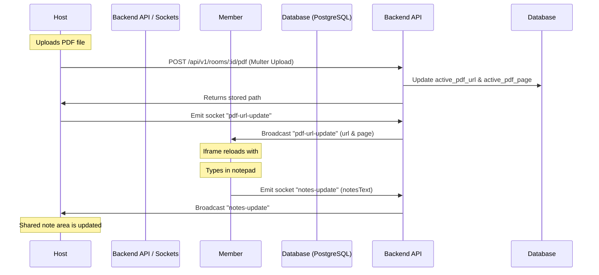

# Collaborative Study Mode Documentation

This document explains the design, architecture, and implementation details of the real-time Collaborative Study Mode (Study Workspace) in the Watch2Gether platform.

---

## 1. Architectural Overview

The Collaborative Study Mode is designed for study groups, coding sessions, and community events. It provides a split-workspace layout:
1. **Left Panel (Synchronized PDF Viewer)**: Hosts and co-hosts can upload PDF files or paste direct web links to documents. The viewport page and document reference are synchronized in real-time.
2. **Right Panel (Shared Study Notes & Snapshots)**: A collaborative markdown text editor synchronized in real-time among members, with the ability to take, restore, and export persistent session snapshots.

The system uses a combination of **REST APIs** for persistent document storage (snapshots and file uploads) and **WebSockets (Socket.io)** for real-time state synchronization.



---

## 2. Document & State Synchronization

### A. Real-Time Shared Notepad (Notes Sync)
Unlike complex Operational Transformation (OT) or CRDT frameworks, the notepad uses a lightweight **last-write-wins (LWW) delta broadcast** approach suitable for lightweight real-time note-taking:
* When a user changes the text in the notepad, a `notes-update` event is dispatched containing the full document text.
* To prevent the cursor from jumping to the end of the text area when programmatically updating the text area value, the editing cursor selections (`selectionStart`, `selectionEnd`) are cached immediately before the state mutation, and restored inside a `setTimeout(..., 0)` block.
* Non-editing clients apply the incoming text directly without selection updates, ensuring a seamless visual experience.

### B. Synchronized PDF Viewer
Instead of heavy PDF processing libraries that bloat the client-side bundle, the platform leverages the browser's native PDF viewing engine inside a sandboxed `<iframe>`:
* **File Uploads**: Restrict files to `application/pdf` with a 10MB limit. Uploaded PDFs are stored in the backend static uploads directory (`/uploads/pdf-...`).
* **Page Anchors**: Native browser PDF readers support hash routing parameters like `#page=X`. Whenever the host clicks "Next Page", "Previous Page", or jumps to a specific page number, the socket events update the room's `active_pdf_page`.
* **Sync Loading**: The iframe URL is set as `http://backend-server/uploads/pdf-filename.pdf#page=X`. React keys are bound to `${activePdfUrl}-${activePdfPage}`, causing the iframe to selectively update and jump directly to the synchronized page coordinate.

---

## 3. Real-Time Socket Events

The Study Workspace introduces the following event schema over the WebSocket connection:

### `study-init`
* **Flow**: Server $\rightarrow$ Client (on join)
* **Payload**:
  ```json
  {
    "sharedNotes": "### Meeting notes...",
    "activePdfUrl": "/uploads/pdf-17817632.pdf",
    "activePdfPage": 3
  }
  ```
* **Description**: Delivers the current active notes state and shared document reference to new room attendees upon joining.

### `notes-update`
* **Flow**: Client $\rightarrow$ Server $\rightarrow$ Room (Broadcast)
* **Payload**:
  ```json
  {
    "text": "Updated study notes contents..."
  }
  ```
* **Description**: Broadcasts real-time changes to the notepad.

### `pdf-url-update`
* **Flow**: Host/Co-host $\rightarrow$ Server $\rightarrow$ Room (Broadcast)
* **Payload**:
  ```json
  {
    "pdfUrl": "/uploads/pdf-12345.pdf",
    "page": 1
  }
  ```
* **Description**: Propagates a newly uploaded PDF or external web link.

### `pdf-page-update`
* **Flow**: Host/Co-host $\rightarrow$ Server $\rightarrow$ Room (Broadcast)
* **Payload**:
  ```json
  {
    "page": 4
  }
  ```
* **Description**: Synchronizes document scrolling and page progression.

---

## 4. Persistent Snapshots (Session Notes)

To prevent work loss, users can capture static snapshots of active notes to a persistent PostgreSQL backend.

### Database Schema (`session_notes`)
```sql
CREATE TABLE IF NOT EXISTS session_notes (
  id SERIAL PRIMARY KEY,
  room_id INTEGER REFERENCES rooms(id) ON DELETE CASCADE,
  title VARCHAR(100) NOT NULL,
  content TEXT NOT NULL,
  created_by INTEGER REFERENCES users(id) ON DELETE SET NULL,
  created_at TIMESTAMP WITH TIME ZONE DEFAULT CURRENT_TIMESTAMP
);
```

### API Endpoints
* **`GET /api/v1/rooms/:id/session-notes`**: Fetch the list of historical snapshots saved in the room.
* **`POST /api/v1/rooms/:id/session-notes`**: Save the current editor text as a new named snapshot.
* **`DELETE /api/v1/rooms/:id/session-notes/:noteId`**: Remove a snapshot. Restricted to the author of the snapshot or room host/co-hosts.

---

## 5. Security & Permission Rules

The study workspace implements Role-Based Access Control (RBAC):
* **Hosts & Co-hosts**:
  - Full permissions to update/upload PDF documents and scroll/navigate pages.
  - Can edit, save, load, and delete any session snapshots.
* **Members**:
  - Collaborative editing on the shared notes textarea.
  - Can save named snapshots and load historical snapshots.
  - View-only access to the PDF panel (synchronized to the host).
* **Guests**:
  - Read-Only access to the shared notes (textarea disabled, input field blocked).
  - View-only access to the PDF panel.
  - Cannot save, restore, or delete snapshots.
