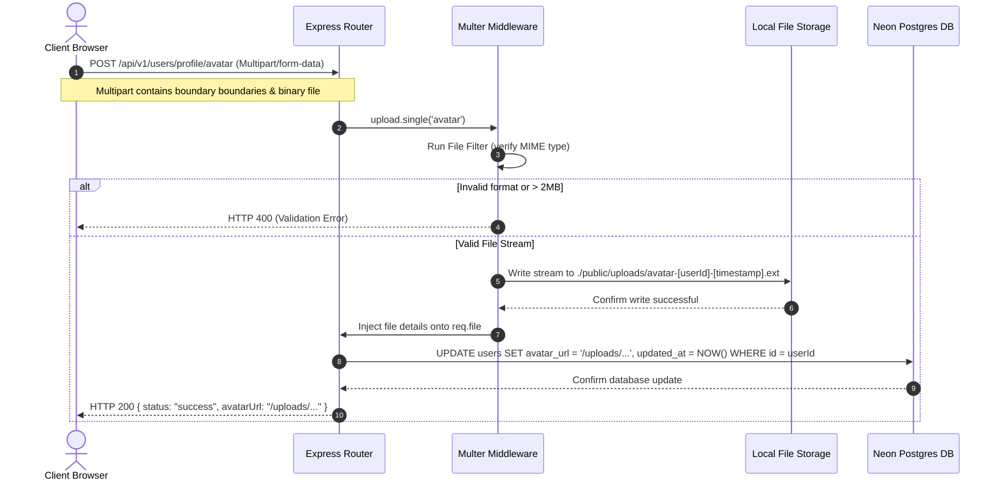

# User Profile Management Documentation

This document describes the design, architecture, database schemas, and implementation details for the **User Profile Management** system in Watch2Gether.

---

## 1. Concepts: Authentication vs. Authorization

When building secure web applications, it is vital to distinguish between **Authentication (AuthN)** and **Authorization (AuthZ)**.

| Concept | Authentication (AuthN) | Authorization (AuthZ) |
| :--- | :--- | :--- |
| **Definition** | Verifying **who** a user is. | Verifying **what** a user is allowed to do. |
| **Mechanism** | Login forms, password hashing validation, and signing JWT tokens. | Middleware checks, group permissions, and database record ownership checks. |
| **Context** | "Is this JWT signature valid and unexpired?" | "Does the authenticated User ID match the ID of the profile being edited?" |

### Implementation in Watch2Gether:
* **Authentication**: Enforced globally on profile routes via the `requireAuth` middleware. It checks the JWT access token in the `Authorization: Bearer <token>` header, decodes it, and sets `req.user` if valid.
* **Authorization**: Before any profile update, password change, or file upload, the backend authorizes the action because the route handlers only apply mutations where `users.id` equals `req.user.id` (retrieved directly from the secure JWT payload). The user cannot modify other users' records.

---

## 2. Architecture Flows

### A. Profile Update Flow
When a user updates details like their username or email:
1. The client sends a `PUT /api/v1/users/profile` request with a JSON payload.
2. The `validateBody` middleware validates inputs against a Zod schema (`updateProfileSchema`).
3. The database is checked to ensure that the new `username` is not already taken by another user.
4. The user profile is updated, and the new details are sent back to the client.
5. The frontend updates both local state (`profileData`) and global context (`updateUser()`) to refresh the header navigation immediately.

### B. Password Change Flow
For security, password changes require verification of the existing password:
1. The client sends a `PUT /api/v1/users/profile/password`.
2. The user's record is loaded from the database to retrieve the stored Bcrypt hash.
3. The old password is compared using `bcrypt.compare()` against the stored hash. If they do not match, a `400 Bad Request` is returned.
4. If valid, the new password is hashed via `bcrypt.hash()` with 10 salt rounds.
5. The database record is updated with the new password hash.

### C. File Upload Architecture Flow
The avatar upload process handles binary file streams securely via `multer`:



---

## 3. Database Schema & Queries

The user profile features operate on the `users` table:

```sql
ALTER TABLE users ADD COLUMN avatar_url text;
```

### Drizzle Queries vs. Equivalent Raw SQL

#### 1. View Profile
* **Drizzle ORM:**
  ```javascript
  const [user] = await db
    .select({
      id: users.id,
      username: users.username,
      email: users.email,
      avatarUrl: users.avatarUrl,
      createdAt: users.createdAt,
    })
    .from(users)
    .where(eq(users.id, req.user.id))
    .limit(1);
  ```
* **Raw SQL Equivalent:**
  ```sql
  SELECT id, username, email, avatar_url, created_at 
  FROM users 
  WHERE id = $1 
  LIMIT 1;
  ```

#### 2. Update Details
* **Drizzle ORM:**
  ```javascript
  const [updatedUser] = await db
    .update(users)
    .set({
      username: username,
      email: email,
      updatedAt: new Date(),
    })
    .where(eq(users.id, req.user.id))
    .returning();
  ```
* **Raw SQL Equivalent:**
  ```sql
  UPDATE users 
  SET username = $1, email = $2, updated_at = NOW() 
  WHERE id = $3 
  RETURNING id, username, email, avatar_url;
  ```

#### 3. Change Password
* **Drizzle ORM:**
  ```javascript
  await db
    .update(users)
    .set({ passwordHash: newPasswordHash, updatedAt: new Date() })
    .where(eq(users.id, req.user.id));
  ```
* **Raw SQL Equivalent:**
  ```sql
  UPDATE users 
  SET password_hash = $1, updated_at = NOW() 
  WHERE id = $2;
  ```

#### 4. Upload Avatar
* **Drizzle ORM:**
  ```javascript
  await db
    .update(users)
    .set({ avatarUrl, updatedAt: new Date() })
    .where(eq(users.id, req.user.id));
  ```
* **Raw SQL Equivalent:**
  ```sql
  UPDATE users 
  SET avatar_url = $1, updated_at = NOW() 
  WHERE id = $2;
  ```

#### 5. Remove Avatar
* **Drizzle ORM:**
  ```javascript
  await db
    .update(users)
    .set({ avatarUrl: null, updatedAt: new Date() })
    .where(eq(users.id, req.user.id));
  ```
* **Raw SQL Equivalent:**
  ```sql
  UPDATE users 
  SET avatar_url = NULL, updated_at = NOW() 
  WHERE id = $1;
  ```

---

## 4. API Endpoints Reference

All profile endpoints reside under the `/api/v1/users` router and require an `Authorization: Bearer <JWT>` header:

| Method | Endpoint | Description | Payload Constraints |
| :--- | :--- | :--- | :--- |
| **GET** | `/profile` | Retrieves current authenticated profile. | None |
| **PUT** | `/profile` | Updates username and/or email address. | JSON: `{ username?, email? }` (Zod validation rules apply) |
| **PUT** | `/profile/password` | Changes the password. | JSON: `{ oldPassword, newPassword }` |
| **POST**| `/profile/avatar` | Uploads an avatar image. | FormData: `avatar: File` (MIME image/*, max 2MB) |
| **DELETE**| `/profile/avatar` | Removes/deletes the avatar image. | None |
