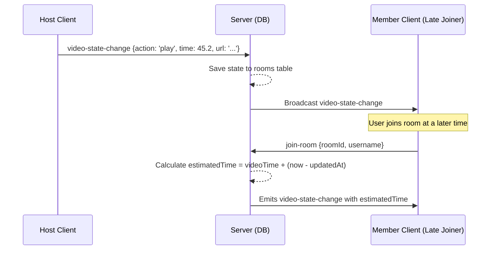

# Video Playback Synchronization Protocol

This document details the architecture, state synchronization flow, WebSocket event schema, and drift-correction algorithm used to keep media players perfectly in sync across different user sessions in a watch lounge.

---

## 1. High-Level Architecture

The watch lounge uses a **client-server hybrid** model for state sync:
* **Host Authority**: The lounge Host (or Co-hosts) controls the playback states (`play`, `pause`, `seek`, `skip`).
* **Database State Store**: The server stores playback state (`video_state`), the timestamp of the last action (`updated_at`), and the playback position in seconds at that timestamp (`video_time`).
* **Active Queue**: The lounge maintainers and participants can manage a playlist queue stored in the `video_queue` database table.



---

## 2. Synchronization Logic & Late-Joiner Catch-up

When a new client joins or re-establishes a disconnected socket connection, requesting the latest room state from the host client would introduce additional network overhead, latency, and a single point of failure (if the Host is offline). 

Instead, the server dynamically estimates elapsed playback time on the fly:

$$\text{estimatedTime} = \text{videoTime} + (\text{currentTime} - \text{updatedAt})$$

### Rules
1. **If state is `'play'`**: The video has been running continuously since `updatedAt`. The server calculates the elapsed time and adds it to the last saved `videoTime`.
2. **If state is `'pause'`**: The video was paused at `videoTime`, so the estimated playback time is simply `videoTime`.
3. **Boundary limits**: If the calculated `estimatedTime` exceeds the actual duration of the video, it is capped, or transitions to the next item if a queue is active.

---

## 3. Drift Correction & Heartbeats

### The Drift Threshold
Network jitter and device hardware performance differences can cause client video playback clocks to drift over time.
* **Drift Threshold**: Set to **`1.5 seconds`** on client browsers.
* If a client receives a sync signal where $|\text{localTime} - \text{syncedTime}| > 1.5\text{s}$, the player triggers a local seek (`seekTo`) to align with the source of truth.
* Differences under `1.5 seconds` are ignored to prevent jumpy playback or infinite seek loops.

### Host Heartbeats
* The Host (and Co-hosts) clients send a periodic synchronization heartbeat event every **10 seconds** while playing:
  ```json
  {
    "action": "play",
    "time": 85.34,
    "videoUrl": "https://example.com/video.mp4"
  }
  ```
* This ensures that any drifted peer is automatically corrected within 10 seconds.

---

## 4. WebSocket Event Schema

### 4.1. Playback Events

#### `video-state-change` (Client $\rightarrow$ Server / Server $\rightarrow$ Room)
Dispatched on local player interaction and server broadcast.
* **Payload**:
  ```typescript
  interface VideoStateChangePayload {
    action: 'play' | 'pause' | 'seek';
    time: number;       // Elapsed time in seconds
    videoUrl?: string;  // Active video URL
  }
  ```

---

### 4.2. Playlist Queue Events

The queue is backed by the `video_queue` table and supports three user actions.

#### `add-to-queue` (Client $\rightarrow$ Server)
Appends a new video URL to the playlist.
* **Payload**:
  ```typescript
  interface AddToQueuePayload {
    videoUrl: string;
  }
  ```

#### `remove-from-queue` (Client $\rightarrow$ Server)
Removes a specific video item from the playlist queue by ID. Available to Host, Co-hosts, or the member who added it.
* **Payload**:
  ```typescript
  interface RemoveFromQueuePayload {
    queueItemId: number;
  }
  ```

#### `skip-video` (Client $\rightarrow$ Server)
Transition immediately to the next unplayed video in the queue. Only available to Host and Co-hosts.
* **Payload**: `void`

#### `queue-update` (Server $\rightarrow$ Room)
Sent by the server to all clients in the room whenever a queue modification occurs (add, remove, skip).
* **Payload**:
  ```typescript
  interface QueueUpdatePayload {
    id: number;
    roomId: string;
    videoUrl: string;
    title: string;
    addedByUsername: string;
    isPlayed: boolean;
    createdAt: string;
  }[]
  ```
