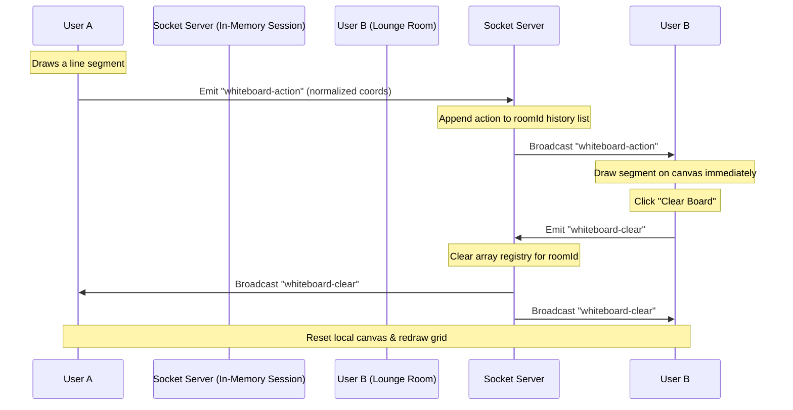

# Collaborative Whiteboard Documentation

This document explains the design, architecture, and implementation details of the real-time Collaborative Whiteboard in the Watch2Gether platform.

---

## 1. Architectural Overview

The collaborative whiteboard is a real-time drawing workstation where multiple room participants can draw paths, erase sections, place geometric shapes (lines, rectangles, circles), and type text annotations simultaneously. 

The system uses an **event-driven synchronization model** rather than transferring heavy canvas image data. Every stroke, shape, or text object is treated as an discrete *action*. These actions are captured, serialized, and broadcast in real-time.



---

## 2. Canvas Synchronization & Scaling

### Coordinates Normalization (Critical for Multi-Device UX)
Users access the lounge page from varied viewports (desktops, tablets, mobile browsers). Standard pixel coordinates (e.g. `clientX` or `offsetX`) do not scale. Drawing at `(500, 300)` on a large monitor would appear truncated or misplaced on a small mobile device.

To resolve this, coordinates are **normalized** relative to the canvas aspect bounding box to values between `0.0` and `1.0`:

$$\text{Normalized } X = \frac{\text{Absolute } X}{\text{Canvas Width}}$$
$$\text{Normalized } Y = \frac{\text{Absolute } Y}{\text{Canvas Height}}$$

When rendering, each client maps these values back to their local canvas dimensions:

$$\text{Local } X = \text{Normalized } X \times \text{Local Canvas Width}$$
$$\text{Local } Y = \text{Normalized } Y \times \text{Local Canvas Height}$$

### Redrawing & Layout Updates
Changing canvas height or width properties in HTML5 resets the canvas content. We bind a resize handler `handleResize()` to the browser window. When a resize event occurs:
1. Re-calculate absolute canvas dimensions to match the parent container width while maintaining a **16:9 aspect ratio** (matching the video player).
2. Set the canvas width and height.
3. Repaint the canvas from scratch by cycling through the cached actions history using local dimensions.

---

## 3. Real-Time Socket Events

The real-time communication flow uses three main Socket.io events:

### A. `whiteboard-init`
* **Flow**: Client $\rightarrow$ Server (Request) / Server $\rightarrow$ Client (Response)
* **Description**: Dispatched when a client joins a lounge room. 
* **Payload**:
  ```json
  [
    {
      "type": "segment",
      "tool": "pen",
      "x0": 0.124,
      "y0": 0.352,
      "x1": 0.128,
      "y1": 0.360,
      "color": "#6366f1",
      "width": 4
    },
    {
      "type": "shape",
      "shapeType": "rect",
      "startX": 0.45,
      "startY": 0.2,
      "endX": 0.65,
      "endY": 0.5,
      "color": "#f43f5e",
      "width": 4
    }
  ]
  ```

### B. `whiteboard-action`
* **Flow**: Client $\rightarrow$ Server $\rightarrow$ Other Clients (Broadcast)
* **Description**: Transmits drawing segments, completed shapes, or committed text.
* **Payload Examples**:
  * **Freehand Drawing segment**:
    ```json
    {
      "type": "segment",
      "tool": "pen", // or "eraser"
      "x0": 0.152,
      "y0": 0.224,
      "x1": 0.160,
      "y1": 0.230,
      "color": "#ffffff",
      "width": 4,
      "strokeId": "abc123z"
    }
    ```
  * **Shape segment**:
    ```json
    {
      "type": "shape",
      "shapeType": "circle", // "rect", "line", "circle"
      "startX": 0.22,
      "startY": 0.15,
      "endX": 0.35,
      "endY": 0.40,
      "color": "#10b981",
      "width": 4
    }
    ```
  * **Text segment**:
    ```json
    {
      "type": "text",
      "text": "Meeting Agenda",
      "x": 0.05,
      "y": 0.05,
      "color": "#f59e0b",
      "fontSize": 18
    }
    ```

### C. `whiteboard-clear`
* **Flow**: Client $\rightarrow$ Server $\rightarrow$ All Room Clients (Broadcast)
* **Description**: Triggers a global canvas wipe. The server resets the in-memory action array to empty `[]`.

---

## 4. Security & Permissions Control

The system implements Role-Based Access Control (RBAC):
* **Hosts, Co-hosts, Members**:
  - Full permissions to draw, erase, shape, text, and clear.
* **Guests**:
  - Read-Only permissions.
  - Interactive drawing events are completely blocked on the frontend canvas layer.
  - The whiteboard settings panel is replaced with a clean `Read Only` notification badge.
  - The backend verifies roles when a client attempts a `whiteboard-clear` request.

---

## 5. In-Memory Backend Cleanup

To prevent memory leaks as users create rooms and leave, the backend socket service checks for remaining active room sockets when a client disconnects or explicitly leaves.
If `io.sockets.adapter.rooms.get(roomId)` returns undefined or has a size of `0` (meaning no users are connected to the channel), the whiteboard session registry is cleaned up and deleted:

```javascript
whiteboardSessions.delete(roomId);
```
This ensures zero residual memory footprint for inactive rooms.
